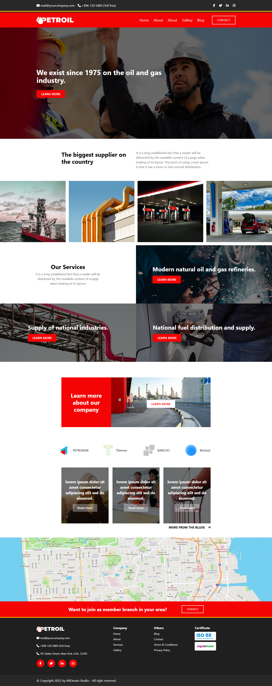

# Oil & Gas Company Website

This is a fully responsive website for an Oil & Gas Company, built using **HTML**, **Tailwind CSS**, and **JavaScript**. The design is modern, professional, and suitable for showcasing services and information related to the oil and gas industry.

### 🔗 Live Website:
👉 [Click to View Live](https://oil-gas-company.netlify.app/)

---

## 🚀 Features

- 💻 Responsive Layout (Mobile, Tablet, Desktop)
- 🎨 Clean and Modern Design
- 🧭 Navigation Bar with scroll animation
- 🖼️ Hero section with overlay text
- 🛠️ Service / About / Blog / Gallery Sections
- 📞 Contact Button with CTA
- ✨ Smooth Scroll and Animations

---

## 🛠️ Technologies Used

- HTML5
- Tailwind CSS
- Vanilla JavaScript

---

## 📸 Project Screenshot

